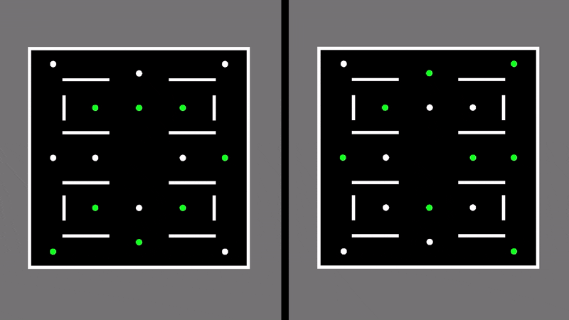
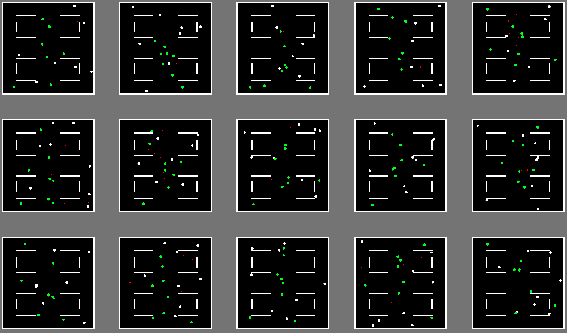
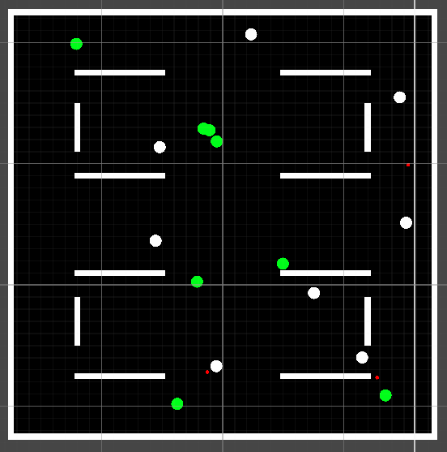
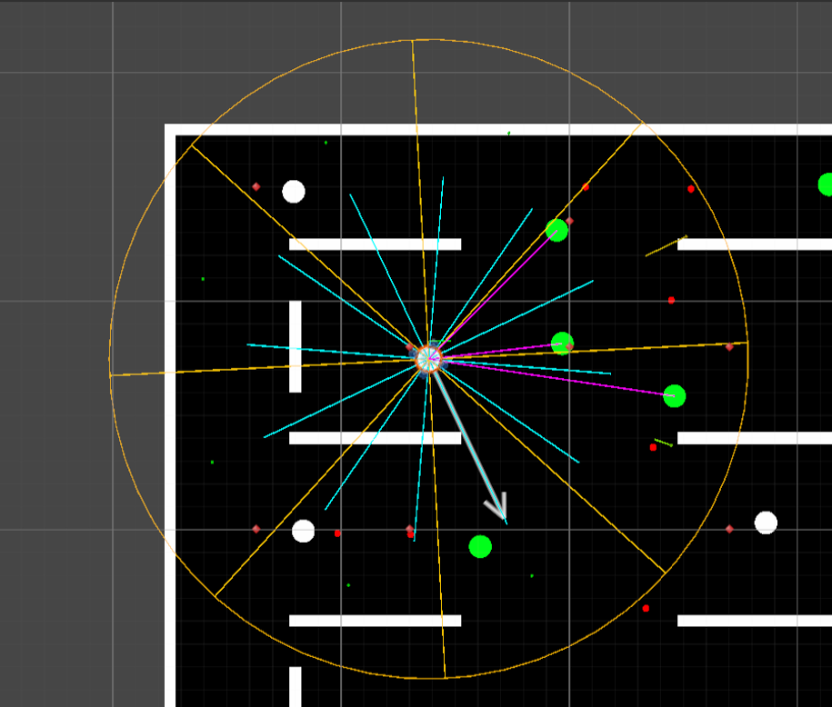
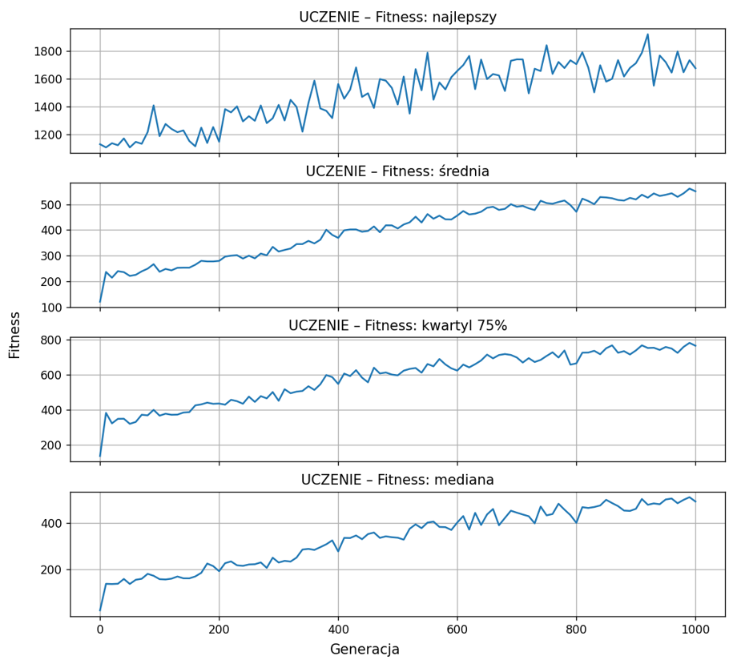

# AI Bots Evolution Simulator

A research-oriented project focused on evolving autonomous combat agents in a 2D top-down environment using Neural Networks optimized through a Genetic Algorithm.

The goal of the project is to investigate how evolutionary methods can develop effective combat behaviors without manually programmed strategies.

 

  
   
  <i>Comparison of early and advanced evolution stages using baseline parameters.</i>

 

## Overview

This simulation was developed as part of my Master's Thesis focused on evolutionary AI methods in game environments.

The project consists of multiple parallel arenas where AI-controlled bots compete against each other and against scripted opponents.

Each bot perceives its environment through sensors and makes decisions using a feed-forward neural network.

Instead of using backpropagation or reinforcement learning, network weights are optimized through genetic evolution across generations.

 

  
   
  <i>Simulation overview (15 parallel arenas).</i>

 

## Tech stack & setup
* **Game Engine:** Unity 6
* **Language:** C#
* **AI/ML Methods:** Custom Neural Networks, Custom Genetic Algorithms
* **Parallel Arenas:** 15
* **AI Population:** 120 bots

 

  
   
  <i>Close-up view of a single combat arena layout during an active generation.</i>

 

## Features

### Neural network controller
* Custom feed-forward neural network implementation
* Fully connected layers with configurable architecture
* Mutation support
* No external ML libraries used (pure C# implementation)

### Genetic algorithm
* Population-based optimization (selection, crossover, and reproduction)
* Weight mutation and Elitism support
* Multi-generation evolution

### Bot perception system
Bots receive information about:
* Distance to obstacles (raycasts)
* Enemy presence in directional sectors
* Line-of-sight visibility checks
* Current health and weapon cooldown

 

  
   
  <i>In-engine visualization of a bot raycasts and directional perception sectors.</i>

 

### Bot actions
Neural networks control:
* Forward movement & Rotation (Left/Right)
* Shooting mechanics

### Combat simulation
* Projectile-based combat with a custom damage/respawn system
* Multiple simultaneous arenas running in parallel
* Mid-generation resets for increased scenario diversity

### Experimentation tools
* Deterministic seeds for reproducible runs
* Multiple independent replicates
* CSV statistics export
* Per-generation performance tracking
* Evaluation mode with frozen genomes
* Adjustable simulation speed via keyboard for faster testing

 
 
 

## Architecture (Core classes)
| Class | Responsibility |
| :--- | :--- |
| **Matrix** | Matrix operations used by neural networks for forward propagation. |
| **NeuralNetwork** | Handles forward propagation, layers setup, and mutation. |
| **Genome** | Represents a single neural network individual's weights. |
| **GeneticAlgorithm** | Manages the evolution process (selection, crossover). |
| **PopulationManager**| Controls the generation lifecycle management. |
| **ArenaManager** | Handles arena simulation, spawning, and environment rules. |
| **BotAgent** | Core AI script handling perception, actions, and fitness calculation. |
| **RandomBot** | Scripted/random baseline opponent used for testing. |
| **Bullet** | Projectile simulation and hit detection. |
| **GameManager** | Multi-arena coordination and global state. |

 

## Fitness Function
Agents are rewarded or penalized based on their behavior to maximize learning efficiency:

**Rewards:**
* Survival time
* Distance traveled
* Successful hits & Damage dealt
* Eliminations (Kills)

**Penalties:**
* Wall collisions
* Staying idle
* Repetitive behavior / Spinning in circles

 
 
## Example Evolution Process
1. Generate an initial random population.
2. Simulate combat across all arenas simultaneously.
3. Evaluate fitness for each bot based on the fitness function.
4. Select the best-performing genomes (elitism).
5. Create offspring through crossover and mutation.
6. Repeat for hundreds or thousands of generations.

 

  
   
  <i>Evolution training curve showing the baseline model fitness score progression over 1000 generations.</i>

 

## Future Improvements
* NEAT integration
* Advanced fitness shaping & Team-based combat

---
*Note: This repository serves primarily for source code review. To run the simulation, the project needs to be opened locally via the Unity Editor.*
